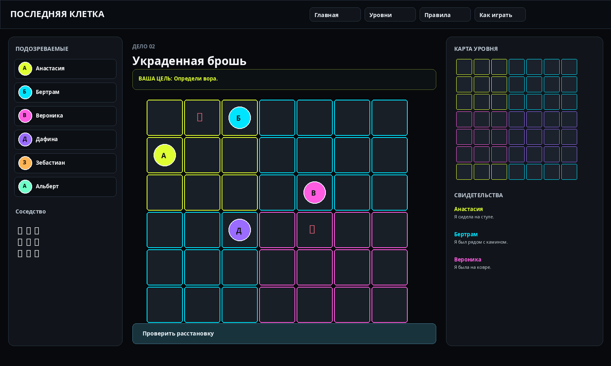
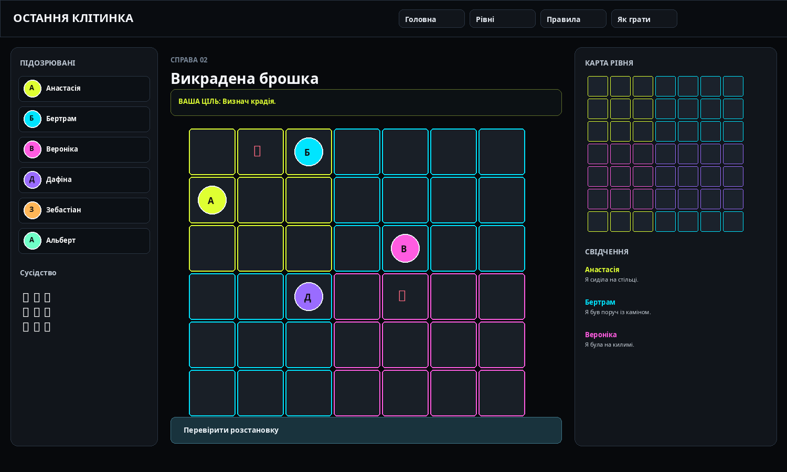
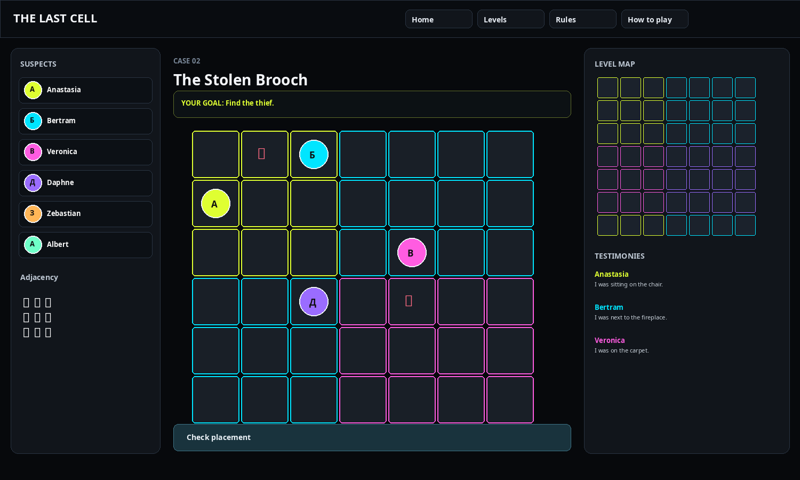

# The Last Cell / Последняя клетка / Остання клітинка

Небольшой логический детективный проект, который я делаю как pet project.

Идея началась с обычного Судоку: мне понравилось само ощущение, когда ты не угадываешь ответ, а постепенно убираешь невозможные варианты. Отсюда появилась мысль перенести тот же принцип в детективную игру — добавить комнаты, предметы, персонажей, свидетельства и поиск виновника.

Проект постепенно вырос из простого поля в полноценную локальную игру с сотнями дел, обучением, сохранением прогресса и тремя языками.

---

## Навигация по README

**RU** · [Русский](#русский)

**UA** · [Українська](#українська)

**EN** · [English](#english)

---

# Русский

[↑ К навигации](#навигация-по-readme)

## О проекте

**«Последняя клетка»** — логическая детективная игра, где игрок сам решает головоломку.

Здесь нет идеи «нажми кнопку — программа скажет ответ». Наоборот: программа следит за правилами, показывает ограничения и помогает не запутаться, а сам вывод делает игрок.

Главная механика пришла из Судоку. На поле есть строки и столбцы, которые постепенно исключаются. Но вместо цифр здесь персонажи и комнаты, а вместо обычных подсказок Судоку — показания персонажей и связи с предметами.

Название игры появилось из основного правила: после правильной расстановки должна остаться **последняя свободная клетка**, которая становится местом жертвы или главным местом события.

## Что нужно сделать игроку

В каждом деле игроку нужно:

1. прочитать цель расследования;
2. изучить персонажей и их показания;
3. выбрать персонажа;
4. поставить его на допустимую клетку;
5. учитывать занятую строку и столбец;
6. использовать карту уровня;
7. проверять связи с предметами;
8. делать собственные заметки;
9. найти последнюю клетку;
10. определить виновника.

## Главные правила

### 1. Одна строка — один подозреваемый

Если персонаж уже стоит в строке, другой подозреваемый больше не может находиться в этой строке.

### 2. Один столбец — один подозреваемый

Точно так же работает столбец.

Важно: **диагонали не участвуют** в этом правиле.

То есть персонаж не закрывает диагональные клетки.

### 3. Что значит «рядом»

Это правило в игре намеренно очень простое:

```text
✕ ✅ ✕
✅ ○ ✅
✕ ✅ ✕
```

`○` — объект.

Соседними считаются только четыре клетки:

- сверху;
- снизу;
- слева;
- справа.

Диагонали не считаются. Клетка через две позиции тоже не считается соседней.

В игре есть отдельная кнопка **«Соседство»**, которая позволяет выбрать объект и визуально увидеть эти четыре клетки.

### 4. Последняя клетка

После расстановки всех подозреваемых должна остаться:

- одна свободная строка;
- один свободный столбец.

Их пересечение — последняя клетка.

Именно там находится жертва или центральное событие дела.

### 5. Что можно занимать

- 🧶 ковёр;
- 🛏️ кровать;
- 🪑 стул / кресло;
- обычные свободные клетки.

### 6. Что нельзя занимать

- 🪟 окно;
- 🔥 камин;
- 🕯️ канделябр;
- 🪑 стол;
- 🍽️ длинный стол;
- 🪴 вазон;
- 📚 книжный шкаф;
- 🗄️ шкаф.

Окна могут находиться только на внешнем периметре дома.

## Как выглядит интерфейс



На основном экране всё разделено достаточно просто:

- **слева** — персонажи;
- **по центру** — поле;
- **справа сверху** — карта уровня;
- **справа ниже** — свидетельства;
- внизу — действия игрока и выбор виновника.

Это специально сделано без лишних окон: игрок должен видеть поле, карту и показания одновременно.

## Карта уровня

Карта — не просто картинка.

Она показывает:

- инициалы персонажей;
- `☠` — последнюю клетку / жертву;
- `✕` — запрещённые клетки;
- `✕` — строки и столбцы, которые уже заняты.

По сути, это второй рабочий лист игрока.

## Свидетельства

Каждый персонаж может сообщать:

- где он был;
- в какой строке или столбце находился;
- на каком объекте был;
- рядом с каким объектом находился;
- в какой комнате был.

Постепенно отдельные подсказки складываются в одну логическую цепочку.

Я сознательно не делал все подсказки прямыми. На сложных уровнях приходится сопоставлять несколько условий сразу.

## Разные типы дел

Игра не ограничивается убийствами.

В разных делах можно искать:

- убийцу;
- вора;
- саботажника;
- шпиона;
- виновника вандализма;
- контрабандиста и другие роли.

Механика поля остаётся той же, но меняется история и цель расследования.

## Комнаты и атмосфера

Все комнаты находятся внутри одного дома или другой общей локации.

В зависимости от главы можно встретить, например:

- гостиную;
- столовую;
- библиотеку;
- спальню;
- архив;
- сцену;
- лабораторию;
- радиорубку;
- башню;
- хранилище;
- оранжерею;
- и другие тематические помещения.

Комнаты отличаются цветом границ, чтобы игрок мог быстро понимать, где заканчивается одна зона и начинается другая.

## Обучение

В игре есть отдельный раздел **«Как играть»**.

Он разбит на несколько простых шагов и показывает сам принцип, а не просто перечисляет правила текстом:

1. выбор персонажа;
2. установка на поле;
3. закрытие строки и столбца;
4. точное соседство;
5. заметки;
6. ограничения объектов;
7. работа с картой;
8. поиск последней клетки и виновника.

Главная задача обучения — чтобы новый игрок смог начать решать дело без отдельной инструкции.

## Система уровней

В текущей версии — **442 дела**.

Они разделены на тематические ветки и постепенно увеличивают сложность.

На ранних уровнях подсказки довольно прямые. Позже появляются:

- несколько комнат;
- разные типы мебели;
- длинные столы;
- книжные шкафы;
- ограничения на соседство;
- сочетания строки + комнаты + предмета;
- более косвенные показания;
- разные сюжеты расследований.

## Проверка уровней

Мне было важно не делать уровни вручную «на глаз».

Поэтому для контента есть отдельная проверка, которая ищет решения и проверяет, что:

- решение вообще существует;
- решение единственное;
- оно совпадает с заложенной расстановкой;
- последняя клетка допустима;
- в комнате жертвы остаётся нужный единственный виновник.

Отчёт проверки хранится в проекте как `validation_report_v10.json`.

## Что происходит после ошибки или завершения дела

Игрок может закончить дело несколькими способами:

- правильно определить виновника;
- сдаться;
- дождаться окончания таймера.

После завершения открывается возможность посмотреть правильную расстановку.

Это сделано специально: ответ нельзя подсмотреть заранее.

## Сохранение прогресса

Игра умеет сохранять состояние локально.

Сохраняются в том числе:

- текущий уровень;
- позиции персонажей;
- заметки;
- выбранный персонаж;
- состояние таймера.

После возвращения игрок может продолжить дело, а не начинать его с нуля.

## Локализация

В проекте три языка:

- 🇷🇺 русский;
- 🇺🇦 украинский;
- 🇬🇧 английский.

Перевод касается не только кнопок. Локализованы также:

- цели дел;
- персонажи;
- комнаты;
- объекты;
- свидетельства;
- обучение;
- правила;
- экран уровня.

Пример украинского и английского интерфейса показан ниже в соответствующих разделах README.

## Технологии

Проект intentionally сделан простым по стеку:

- HTML5;
- CSS3;
- Vanilla JavaScript;
- JSON для данных уровней;
- `localStorage` для локального прогресса.

Никакого backend для текущего MVP не требуется.

## Структура проекта

```text
project/
├── index.html
├── styles.css
├── app.js
├── levels.json
├── extra_levels.js
├── extra_levels.json
├── validation_report_v10.json
├── validate_levels.py
├── tutorial_source_assets/
├── docs/
│   └── screenshots/
└── README.md
```

`app.js` — игровая логика и интерфейс.

`styles.css` — оформление, неоновые цвета и адаптивность.

`levels.json` и `extra_levels.*` — контент и данные дел.

`validate_levels.py` — проверка решений уровней.

`docs/screenshots/` — материалы для документации.

## Как запустить

Самый простой вариант:

1. распаковать проект;
2. открыть `index.html` в браузере.

Текущая версия работает локально и не требует npm или отдельного сервера.

## Почему это pet project

Это проект, в котором мне было интересно не просто написать интерфейс, а пройти весь путь:

**идея → механика → правила → UX → контент → валидация → локализация → документация.**

Для меня это хороший способ потренироваться сразу в нескольких направлениях:

- работа с логическими ограничениями;
- проектирование игровых механик;
- UI/UX;
- работа с большим количеством контента;
- локализация;
- проверка данных;
- аккуратная документация.

## Что хотелось бы добавить дальше

План развития проекта примерно такой:

- ещё больше типов подсказок;
- генерация новых уникальных дел;
- более сложные логические цепочки;
- полноценная система профиля;
- статистика игрока;
- достижения;
- звуки и музыка;
- сюжетные главы;
- изображения персонажей;
- онлайн-версия с аккаунтами и синхронизацией прогресса.

---

# Українська

[↑ До навігації](#навігация-по-readme)

## Про проєкт

**«Остання клітинка»** — логічна детективна гра, яку я розробляю як pet project.

Ідея почалася із Судоку. Мені сподобався принцип, коли відповідь не вгадується, а поступово знаходиться через виключення неможливих варіантів. На цій основі я зробив детективне поле з персонажами, кімнатами, предметами та свідченнями.

Це не копія паперової гри. Я взяв саму логічну основу і переробив її під веб-формат, додавши карту, різні типи справ, навчання, збереження прогресу та локалізацію.

## Як працює гра

Гравець читає справу, вивчає свідчення та самостійно розставляє персонажів.

Основна схема така:

1. вибрати персонажа;
2. поставити його на допустиму клітинку;
3. враховувати зайнятий рядок і стовпець;
4. використовувати карту та свідчення;
5. робити нотатки;
6. знайти останню вільну клітинку;
7. визначити винного.

## Основні правила

### Рядок і стовпець

В одному рядку може бути лише один підозрюваний.

В одному стовпці також може бути лише один підозрюваний.

Діагоналі тут не враховуються.

### Що означає «поруч»

Тільки чотири клітини зі спільною стороною:

```text
✕ ✅ ✕
✅ ○ ✅
✕ ✅ ✕
```

`○` — об'єкт.

`✅` — зверху, знизу, ліворуч, праворуч.

`✕` — діагональ, вона не рахується.

У грі є окрема кнопка, яка підсвічує ці чотири клітини.

### Остання клітинка

Коли всі підозрювані розставлені, має залишитися один вільний рядок і один вільний стовпець.

Їх перетин — остання клітинка. У ній знаходиться жертва або головна подія справи.

## Інтерфейс українською



Усі основні елементи знаходяться перед очима: персонажі, поле, карта та свідчення.

## Предмети

На полі можна зустріти:

- 🧶 килими;
- 🛏️ ліжка;
- 🪑 стільці та крісла;
- 🪟 вікна;
- 🔥 каміни;
- 🕯️ канделябри;
- 🪴 вазони;
- 📚 книжкові шафи;
- 🗄️ шафи;
- столи та довгі столи.

## Типи справ

Поступово гравець шукає не лише вбивцю.

Є справи про:

- вбивства;
- крадіжки;
- саботаж;
- шпигунство;
- вандалізм;
- таємне перевезення та інші сюжети.

## Рівні та складність

У поточній версії — **442 справи**.

Рівні побудовані так, щоб складність росла поступово: від коротких навчальних задач до справ з декількома кімнатами, великою кількістю предметів і взаємопов'язаних підказок.

Для рівнів є окрема автоматична перевірка. Вона перевіряє наявність єдиного розв'язку та правильність підготовленої розстановки.

## Навчання

У грі є окремий розділ **«Як грати»**, де основна механіка показана по кроках:

- вибір персонажа;
- постановка на поле;
- закриття рядка і стовпця;
- сусідство;
- нотатки;
- карта;
- остання клітинка;
- пошук винного.

## Локалізація

Підтримуються:

- 🇷🇺 російська;
- 🇺🇦 українська;
- 🇬🇧 англійська.

Перекладені не тільки кнопки, а й сам ігровий контент: цілі справ, персонажі, кімнати, предмети, свідчення, правила та навчальні матеріали.

## Технології

- HTML5;
- CSS3;
- Vanilla JavaScript;
- JSON;
- `localStorage`.

Проєкт запускається локально та не потребує backend.

## Запуск

Розпакувати архів і відкрити `index.html` у браузері.

## Навіщо цей pet project

Мені було цікаво пройти весь шлях від ідеї до готової ігрової системи: придумати правила, зробити інтерфейс, підготувати багато рівнів, перевірити їх логіку, додати локалізацію та оформити документацію.

---

# English

[↑ Back to navigation](#навігація-по-readme)

## About the project

**The Last Cell** is a logic-detective web game that I am building as a pet project.

The idea came from Sudoku. What I like about Sudoku is that the player does not guess the answer — they gradually remove impossible options until only one solution remains.

I wanted to keep that feeling, but replace numbers with people, rooms, objects and witness statements.

The project is not meant to be a direct copy of a specific paper game. The goal is to take the logic-driven part of the idea and turn it into a small standalone game with its own rules, interface, stories and investigation types.

## How the game works

The player reads a case, studies the testimonies and places suspects on the board.

The basic flow is:

1. choose a suspect;
2. place the suspect on a valid cell;
3. respect the occupied row and column;
4. use the map and testimonies;
5. add notes when needed;
6. find the final free cell;
7. identify the culprit.

## Core rules

### One suspect per row

A row can contain only one suspect.

### One suspect per column

A column can also contain only one suspect.

Diagonals do not matter for this rule.

### What “next to” means

Exactly four cells:

```text
✕ ✅ ✕
✅ ○ ✅
✕ ✅ ✕
```

`○` is the object.

`✅` means directly above, below, left or right.

Diagonal cells never count as adjacent.

The game has a separate **Adjacency** button that highlights these four cells visually.

### The last cell

After all suspects are placed, exactly one row and one column should remain free.

Their intersection becomes the **last cell** — the victim's position or the main location of the case.

## English interface



The main screen keeps the important information visible at the same time: suspects on the left, the board in the center, the level map and testimonies on the right.

## Objects and rooms

Different cases can contain:

- carpets;
- beds;
- chairs and armchairs;
- windows;
- fireplaces;
- candelabras;
- plants;
- bookcases;
- wardrobes;
- regular and long tables.

The rooms are parts of one shared building or location. The visual borders help separate them quickly on the board.

## Investigation types

The game is not limited to murder cases.

Depending on the chapter, the player can search for:

- a murderer;
- a thief;
- a spy;
- a saboteur;
- a vandal;
- a smuggler;
- and other roles.

The board mechanics stay the same, while the story and the purpose of the investigation change.

## Levels and difficulty

The current content base contains **442 cases**.

The early cases are designed to teach the core rules. Later cases add more rooms, more objects and more interconnected clues.

The level validation system checks that a prepared case has a valid and unique logical solution.

## Tutorial

The game has a separate **How to play** section.

The tutorial is split into short steps covering:

- choosing a suspect;
- placing a piece;
- blocking the row and column;
- exact adjacency;
- notes;
- object restrictions;
- using the map;
- finding the last cell and the culprit.

The idea is to teach the actual mechanics instead of making the player read a long manual first.

## Localization

The game is available in three languages:

- 🇷🇺 Russian;
- 🇺🇦 Ukrainian;
- 🇬🇧 English.

Localization includes the UI as well as the game content: goals, suspects, rooms, objects, testimonies, rules and tutorial text.

## Tech stack

The project intentionally uses a simple stack:

- HTML5;
- CSS3;
- Vanilla JavaScript;
- JSON;
- `localStorage`.

There is no backend requirement for the current version.

## Run locally

Extract the project and open `index.html` in a browser.

## Why this is a pet project

The interesting part for me was the whole process, not just the final interface:

**idea → rules → game logic → UI → content → validation → localization → documentation.**

It is a compact way to practice game design, constraint-based logic, UX, content management and frontend development in one project.

## Future plans

Possible next steps:

- more clue types;
- generated cases with unique solutions;
- more story-driven chapters;
- player profiles;
- statistics and achievements;
- sound and music;
- character portraits;
- online accounts and synchronized progress.

---

## Project structure

```text
project/
├── index.html
├── styles.css
├── app.js
├── levels.json
├── extra_levels.js
├── extra_levels.json
├── validation_report_v10.json
├── validate_levels.py
├── tutorial_source_assets/
├── docs/
│   └── screenshots/
└── README.md
```

This README is intentionally written as practical project documentation rather than as a marketing page.
